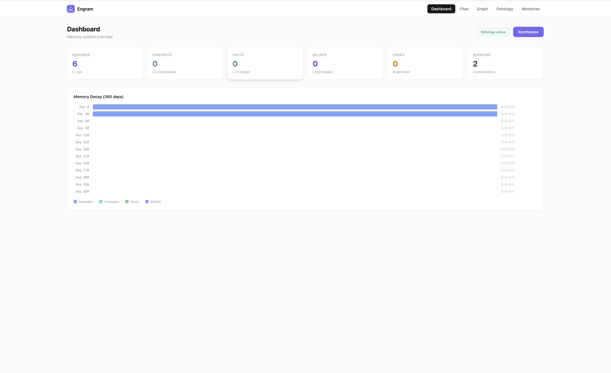
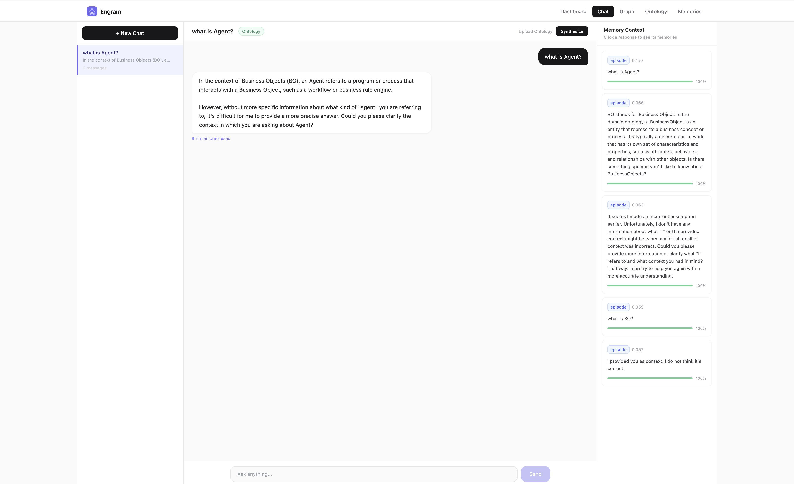
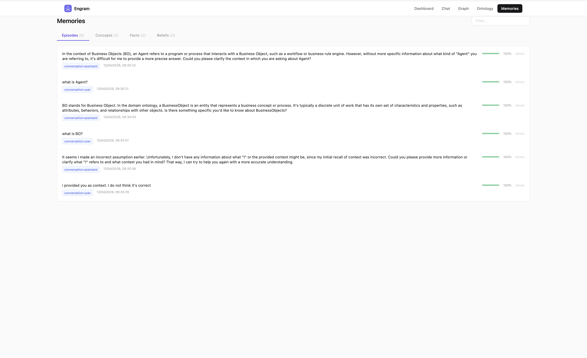
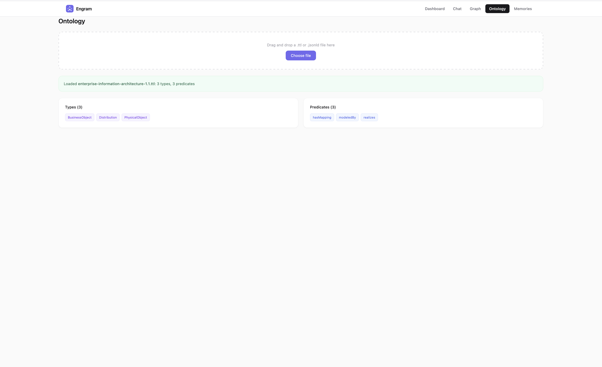

# Engram

**A local first AI memory system with probabilistic decay.**

Engram is not another database. It's a memory engine that works the way biological memory does. Raw experiences compress into understanding, understanding grounds into structured facts, facts distill into wisdom, and everything fades unless it matters.



## Screenshots

| | |
|---|---|
|  |  |
| **Chat** with Ollama, memory augmented responses, per turn provenance | **Memories** browser with episodes, concepts, facts, beliefs |
|  |  |
| **Ontology** upload (Turtle/JSON-LD) with type and predicate display | **Dashboard** with memory stats and decay simulation |

## Why

For 50+ years, databases have stored data as permanent, binary truth. A row exists or it doesn't. But real memory doesn't work that way.

Current approaches to AI memory treat storage as a solved problem. They bolt vector search or knowledge graphs onto traditional stores and call it memory. Underneath, it's still static rows, rigid triples, and flat retrieval. Nothing fades. Nothing deepens. Nothing resolves on its own.

Engram takes a different approach:

1. **Memories fade.** Every memory has a half life. Unused knowledge naturally decays. This isn't a bug. It's how you avoid drowning in stale data.
2. **Contradictions resolve themselves.** Say "I love Java" today and "I hate Java" next month. The newer fact gains weight while the older one decays faster. No manual cleanup.
3. **Understanding deepens over time.** Raw text compresses into concepts, concepts ground into structured facts, facts distill into abstract principles. Four layers, like sediment forming rock.
4. **Domain knowledge is pluggable.** Load a life science ontology and "p53" becomes a Protein, "MDM2" becomes a Gene, and "inhibits" becomes a validated relationship between molecules. Without an ontology, everything still works, just untyped.

## What

Engram has four memory layers, each with different compression and decay rates:

```
L1: Episodes (raw text)           half life: 7 days
        | extract
L2: Concepts (compressed text)    half life: 90 days
        | extract facts
L2.5: Facts (structured triples)  half life: 180 days
        | distill
L3: Beliefs (abstract principles) half life: 365 days
        |
        +-- connected by graph edges (supports, contradicts, reminds_of)
```

**Retrieval** blends four signals into one ranked result:

1. **Vector similarity (50%)** semantic meaning via embeddings
2. **Graph traversal (20%)** structural relationships between beliefs
3. **Structured facts (15%)** exact triple matching and type queries
4. **Recency boost (15%)** newer memories score higher

**Everything runs locally.** No API keys, no cloud, no data leaves your machine.

| Component | Technology |
|---|---|
| LLM | Ollama (llama3.2 or any local model) |
| Embeddings | MiniLM L6 v2 (via ChromaDB, local ONNX) |
| Vector store | ChromaDB (embedded, local files) |
| Graph store | NetworkX + JSON |
| Triple store | SQLite + ChromaDB |
| Episode store | SQLite + ChromaDB |
| Ontology | rdflib (Turtle, JSON-LD) |

## Architecture

```
┌─────────────────────────────────────┐
│   Context Layer (optional)          │
│                                     │
│  Type hierarchy · Protein is_a Mol  │
│  Entity aliases · TP53 > p53        │
│  Predicate rules · Drug treats Dis  │
│  Validation ····· type checking     │
│                                     │
│  Loaded from Turtle or JSON-LD      │
└──────────────┬──────────────────────┘
               │ grounds
┌──────────────▼──────────────────────┐
│      Synthesis Pipeline             │
│                                     │
│  Extractor ···· episodes > concepts │
│  FactExtractor · concepts > triples │
│  Distiller ···· concepts > beliefs  │
│  Deduplicator · merge near dupes    │
│  Contradiction · detect & resolve   │
│  Decay ········ probabilistic fade  │
│                                     │
│  Powered by Ollama (local LLM)      │
└──────────────┬──────────────────────┘
               │ produces
┌──────────────▼──────────────────────┐
│       Four Layer Memory             │
│                                     │
│  L1 Episodes ··· SQLite + ChromaDB  │
│  L2 Concepts ··· ChromaDB vectors   │
│  L2.5 Facts ···· SQLite + ChromaDB  │
│  L3 Beliefs ···· NetworkX graph     │
│                                     │
└──────────────┬──────────────────────┘
               │ queried by
┌──────────────▼──────────────────────┐
│         Retrieval Mixer             │
│  vector similarity ····· 50%        │
│  graph traversal ······· 20%        │
│  structured facts ······ 15%        │
│  recency boost ········· 15%        │
└─────────────────────────────────────┘
```

## How

### Install

```bash
# Prerequisites
brew install ollama
ollama pull llama3.2

# Install Engram
git clone https://github.com/linnaung/engram.git && cd engram
python3 -m venv .venv && source .venv/bin/activate
pip install -e .
```

### CLI

```bash
# Ingest raw memories
engram ingest "I prefer Python for backend development"
engram ingest "Rust impresses me with its memory safety"
engram ingest "Simple composable tools beat monolithic frameworks"

# Synthesize: compress episodes into concepts, facts, and beliefs
engram synthesize
#   Episodes processed:        3
#   Concepts created:          2
#   Facts extracted:           3
#   Beliefs created:           1
#   Edges created:             1

# Recall with hybrid retrieval
engram recall "programming preferences"
#   [1] [L2:CO] (score: 0.272) Python preferred for readability
#   [2] [L2.5:FA] (score: 0.120) User prefers Python
#   [3] [L1:EP] (score: 0.091) I prefer Python for backend development

# See memory stats
engram status
#   L1 Episodes:   3
#   L2 Concepts:   2
#   L2.5 Facts:    3
#   L3 Beliefs:    1
#   Graph Edges:   1
#   Context:       none

# List extracted facts
engram facts list
#   [1] User prefers Python (> Language)  (conf: 0.90)
#   [2] User prefers Rust (> Language)    (conf: 0.85)

# Query facts by entity
engram facts query "Python"
#   User prefers Python (> Language)

# Simulate decay over time
engram simulate --days 365
#   Day   0: Episodes 3/3 (100%) ████████████
#   Day  60: Episodes 0/3 (  0%)
#   Day 360: Concepts 2/3 ( 66%) ████████

# Visualize the belief graph
engram graph  # opens interactive HTML in browser

# Interactive chat with live memory
engram chat
#   you> I've been learning Haskell lately
#     memorized (4 episodes)
#   you> /recall programming
#     [1] [CO] 0.31 | User explores functional programming languages
#   you> /synthesize
#     +2 concepts, +3 facts, +1 beliefs
#   you> /quit

# REST API
engram serve  # starts on http://127.0.0.1:8420
```

### Domain Ontology (optional)

Load a domain ontology to ground facts with types and validated predicates:

```bash
# Set the ontology for all commands
export ENGRAM_CONTEXT_FILE=examples/ontology_lifescience.ttl

# Ingest domain specific knowledge
engram ingest "p53 inhibits MDM2 expression in breast cancer cells"
engram ingest "Imatinib treats chronic myeloid leukemia"

# Synthesize with ontology grounding
engram synthesize
#   Facts extracted: 2

engram facts list
#   [1] p53 inhibits MDM2 (Protein > Gene)  (conf: 0.90)
#   [2] imatinib treats leukemia (Drug > Cancer)  (conf: 0.90)
```

Engram supports standard RDF ontology formats via rdflib:

| Format | Extension | Description |
|---|---|---|
| Turtle | `.ttl` | Compact, human readable RDF syntax |
| JSON-LD | `.jsonld` | JSON based linked data format |

Ships with two example ontologies:

| File | Domain | Types | Predicates |
|---|---|---|---|
| `examples/ontology_general.ttl` | General purpose | Language, Framework, Database, Principle | prefers, knows, uses, values |
| `examples/ontology_lifescience.ttl` | Life science | Protein, Gene, Drug, Disease, Pathway | inhibits, activates, treats, binds_to |

Create your own using standard OWL/RDFS vocabulary:

```turtle
@prefix owl: <http://www.w3.org/2002/07/owl#> .
@prefix rdfs: <http://www.w3.org/2000/01/rdf-schema#> .
@prefix skos: <http://www.w3.org/2004/02/skos/core#> .
@prefix eng: <http://engram.dev/ontology#> .

eng:Molecule a owl:Class ; rdfs:subClassOf eng:Entity .
eng:Protein a owl:Class ; rdfs:subClassOf eng:Molecule .

eng:inhibits a owl:ObjectProperty ;
    rdfs:domain eng:Molecule ;
    rdfs:range eng:Molecule .

eng:p53 a owl:NamedIndividual, eng:Protein ;
    rdfs:label "p53" ;
    skos:altLabel "TP53", "tumor protein p53" .
```

### API Endpoints

```
POST /ingest            store raw text as episode
POST /recall            hybrid retrieval across all layers
POST /synthesize        run the compression pipeline
GET  /status            memory statistics
GET  /facts             query structured fact triples
DELETE /forget/{id}     remove a specific memory
GET  /health            health check
```

### Python SDK

```python
from engram.engine import Engram

engine = Engram()
engine.initialize()

# Optional: load domain ontology
engine.load_context("examples/ontology_lifescience.ttl")

# Ingest
engine.ingest("p53 inhibits MDM2 expression")

# Synthesize (episodes > concepts > facts > beliefs)
result = engine.synthesize_sync()

# Recall
results = engine.recall("p53 interactions")
for r in results:
    print(f"[{r.layer}] {r.score:.3f} | {r.content}")

# Query structured facts directly
facts = engine.facts.query(subject="p53")
for f in facts:
    print(f"{f.subject} [{f.subject_type}] {f.predicate} {f.object} [{f.object_type}]")

engine.close()
```

### Streaming Session (for integration)

```python
from engram.streaming import EngramSession

session = EngramSession(synthesis_interval=300)  # auto synthesize every 5 min
session.start()

session.user("I like composable tools")
session.assistant("Noted, you prefer Unix philosophy")

results = session.recall("design preferences")

session.stop()
```

### Configuration

All settings via environment variables (prefix `ENGRAM_`):

```bash
ENGRAM_OLLAMA_MODEL=llama3.2          # any Ollama model
ENGRAM_OLLAMA_HOST=http://localhost:11434
ENGRAM_DATA_DIR=~/.engram             # where all data lives
ENGRAM_CONTEXT_FILE=                  # path to ontology JSON (empty = no ontology)
ENGRAM_EPISODE_HALF_LIFE_DAYS=7       # L1 decay rate
ENGRAM_CONCEPT_HALF_LIFE_DAYS=90      # L2 decay rate
ENGRAM_FACT_HALF_LIFE_DAYS=180        # L2.5 decay rate
ENGRAM_BELIEF_HALF_LIFE_DAYS=365      # L3 decay rate
ENGRAM_VECTOR_WEIGHT=0.50             # retrieval blend weights
ENGRAM_GRAPH_WEIGHT=0.20
ENGRAM_FACT_WEIGHT=0.15
ENGRAM_RECENCY_WEIGHT=0.15
ENGRAM_MIN_CONFIDENCE=0.05            # garbage collection threshold
```

## Key Ideas

**Probabilistic Decay**
```
confidence(t) = C0 x 0.5^(elapsed / half_life) x reinforcement_boost
```
Each reinforcement (access) extends the effective half life by 20%. Memories you use get stronger. Memories you ignore fade away.

**Four Layer Abstraction**

1. **Episodes** are what you said. They're exact, ephemeral, and decay fast.
2. **Concepts** are what you meant. Extracted by the LLM, they carry vector embeddings.
3. **Facts** are what you know. Structured triples grounded against a domain ontology.
4. **Beliefs** are what you are. Abstract principles that persist for years.

**Contradiction Resolution**

At the fact level: same subject + same predicate + different object = contradiction. Detected instantly, no LLM needed. At the text level: LLM fallback for subtler conflicts. In both cases, newer wins and the older memory's half life is halved.

**Domain Grounding**

Without an ontology, Engram extracts untyped triples: `(User, prefers, Python)`. With an ontology loaded, entities get resolved (`TP53` becomes `p53 [Protein]`), predicates get validated (`Drug treats Disease` is valid, `Disease treats Disease` is not), and aliases collapse to canonical names.

**Auto Reinforcement**

The top 3 results of every recall get their reinforcement count bumped. Useful memories naturally outlive useless ones.

## License

MIT
